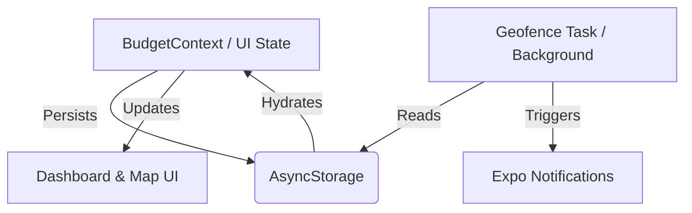

# 🟢 SpotCheck — Proactive Budget Alerts at the Door

  

**SpotCheck** is a geofenced budgeting assistant that helps you stay on track by sending real-time alerts the moment you enter a store. Using background location tracking, the app automatically reminds you of your remaining budget exactly when you need it most, preventing impulsive overspending.

---

## 📲 Download & Demo

### 🤖 Android APK
You can download and install the latest build directly to your Android device:

**[🚀 Download SpotCheck APK](https://expo.dev/accounts/ajdc2021/projects/spotcheck/builds/0bde7e46-e0b7-4421-8560-cea56db237f4)**

  

> [!TIP]
> After downloading, you may need to "Allow installation from unknown sources" in your Android settings to install the APK.

---

## 💎 Premium Features

*   **✨ Landing Screen** — Beautiful, gradient-rich entry point with Indigo & Emerald aesthetics.
*   **📍 Smart Geofencing** — One-tap store pinning with instant background registration.
*   **🔔 Proactive Alerts** — Push notifications triggered by GPS to keep your budget top-of-mind.
*   **📊 Dynamic Dashboard** — Real-time tracking of 5 core budget categories with live progress bars.
*   **💡 Daily Allowance** — Intelligent "Safe Spend" calculation based on the remaining days in the month.
*   **🌙 Dark Fintech UI** — Sleek, modern interface designed for high readability and focus.

---

## 🛠 Tech Stack

| Category | Technology |
|---|---|
| **Frontend** | React Native (Expo) |
| **Language** | JavaScript (ES6+) |
| **Location** | Expo Location & Task Manager |
| **Alerts** | Expo Notifications |
| **Navigation** | Native Stack & Bottom Tabs |
| **Storage** | AsyncStorage |

---

## 📱 How to Demo

1.  **Dashboard**: Open the app to view your budgets. Tap the **minus buttons** to simulate spending.
2.  **Pin a Store**: Navigate to the **Map** tab, select a category, and tap **"📍 Pin This Store"**.
3.  **Trigger Alert**: Move away from the location and return (or use a GPS spoofer) to receive your real-time budget notification.

---

## 🧠 Architecture

### System Data Flow

---

## 📄 License

Built for hackathon demonstration purposes. MIT License.

---

  <b>SpotCheck</b> — Know your budget before you spend. 
  <i>Built with Expo • React Native • Geofencing • 💚</i>

